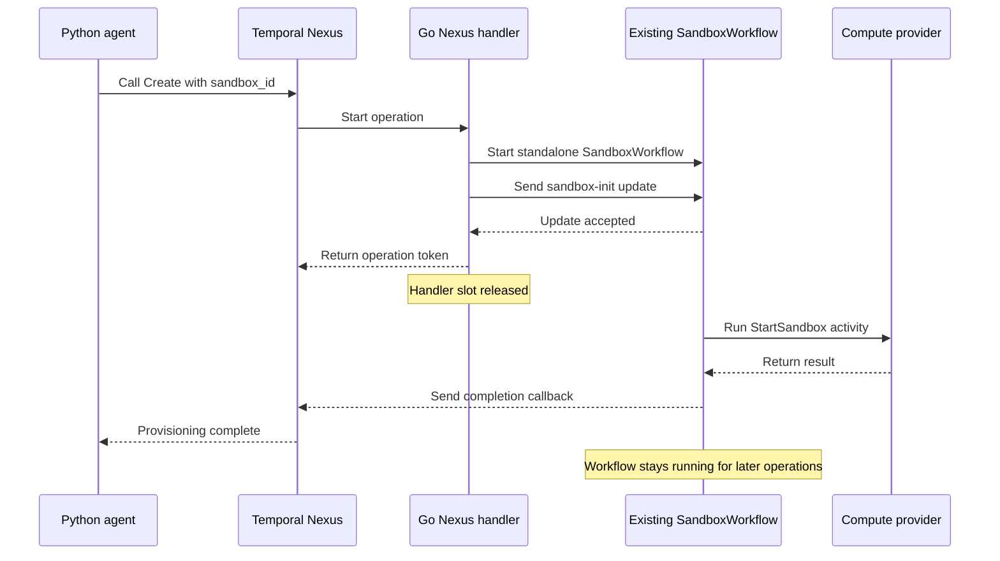

# OpenAI Agents SDK -> Nexus -> sandbox

[agent.py](agent.py) uses the OpenAI Agents SDK with one `run_shell` tool. It
creates a sandbox, runs the agent, and deletes the sandbox in `finally`.

The handler uses the same `SandboxWorkflow` as the Go SDK. It translates the
generated request types and calls the existing workflow updates:



The handler uses `temporalnexus.StartUpdateWorkflow` with
`WorkflowUpdateStageAccepted`. It returns after acceptance and free up the Nexus handler worker. Temporal sends the update
result through a completion callback. Create and Fork start a standalone
`SandboxWorkflow`, then forward provisioning to its existing `sandbox-init`
update.

Delete attaches a completion callback to the running sandbox workflow with
`WORKFLOW_ID_CONFLICT_POLICY_USE_EXISTING`, then sends its existing `sandbox-stop`
signal. It returns an async token. The callback completes after workflow cleanup.
There is one sandbox workflow; Delete does not create another workflow or update
handler.

| Operation | Implementation | Completion means |
| --- | --- | --- |
| Create / Fork | `sandbox-init` update | Provider start / restore finished |
| Execute | `sandbox-execute-command` update | Command result available |
| Suspend / Resume | `sandbox-suspend` / `sandbox-resume` updates | Provider transition finished |
| Snapshot | `sandbox-snapshot` update | Snapshot ID available |
| Delete | `sandbox-stop` signal and workflow completion callback | Provider cleanup finished |
| DeleteSnapshot | `sandbox-delete-snapshot` update | Provider snapshot deletion finished |
| Describe | `sandbox-state` query | Current lifecycle and instance ID |

## Run

Requires Go 1.26.2, Python 3.10+, uv, and a Temporal server with update completion
callbacks and standalone Nexus operations enabled. The example uses Go SDK
1.49.0. Python SDK 1.34.0 is pinned in `uv.lock`. The commands below were tested
with Temporal CLI 1.9.1 / Server 1.32.0. Enable the experimental server features
with these flags:

From the repository root, start a development server:

```bash
temporal server start-dev \
  --dynamic-config-value 'system.enableNexus=true' \
  --dynamic-config-value 'nexusoperation.enableStandalone=true' \
  --dynamic-config-value 'history.enableUpdateCallbacks=true' \
  --dynamic-config-value 'history.enableTransitionHistory=true' \
  --dynamic-config-value 'history.enableChasm=true' \
  --dynamic-config-value 'history.enableCHASMCallbacks=true'
```

In another terminal, create an endpoint for the Go worker:

```bash
temporal operator nexus endpoint create \
  --name sandbox-control --target-namespace default --target-task-queue sandbox-control
```

Set your E2B template ID in a copy of [profiles.example.json](profiles.example.json),
or configure another supported provider. The E2B template must have
Python for the example command. Start the worker from the repository root:

```bash
export E2B_API_KEY=...
export SANDBOX_PROFILES_FILE=/absolute/path/to/profiles.json
go run ./sdk/cmd/nexus-worker
```

Run the Python agent:

```bash
cd examples/nexus-agent
export OPENAI_API_KEY=...
uv run agent.py
```

Both processes read `TEMPORAL_HOST_PORT`, `TEMPORAL_NAMESPACE`, and
`TEMPORAL_API_KEY`. Setting an API key enables TLS. Worker settings:
`SANDBOX_TASK_QUEUE`, `SANDBOX_PROFILES_FILE`. Agent settings:
`SANDBOX_NEXUS_ENDPOINT`, `SANDBOX_PROFILE`.

## Contract and lifecycle

The [IDL](../../sdk/nexus/sandbox.nexusrpc.yaml) defines `sandbox.control.v1`.
Generated bindings: [Go](../../sdk/generated/nexus),
[Python](generated/sandbox_contract).

- Choose `sandbox_id` before Create or Fork. Retry with the same ID and parameters.
  IDs cannot be reused after the workflow closes.
- Only Execute, Snapshot, and Describe return values.
- Idle suspension defaults to five minutes; `-1` disables it.
- Use Delete for cleanup, including after an agent exits. A Nexus timeout does
  not stop a command or delete its sandbox.
- Delete snapshots before closing the workflow and after other sandboxes stop
  using them.
- Provider activities can retry, so provider calls may run more than once.

## Generate and test

Regenerate with `nexgen` 0.2.3, from the repository root:

```bash
make generate-nexus
```

Nexgen can also generate TypeScript or Java bindings from the same IDL. To run
separate Nexus handler and compute workers, register
`sandboxnexus.NewService` on the handler worker and `sandbox.Register` on the
worker polling `Config.TaskQueue`.

Run the integration test against the development server above:

```bash
SANDBOX_NEXUS_TEST_SERVER=localhost:7233 go test ./sdk/nexus -run TestNexusIntegration -v
```

The test creates a temporary endpoint and runs the existing `SandboxWorkflow`
with a fake provider. It blocks provisioning and checks that Describe completes
with one Nexus handler slot. It also checks generated Go payloads, update
callbacks, repeated creation, snapshot/fork, and cleanup completion. It makes no
requests to OpenAI or a real compute provider. Without
`SANDBOX_NEXUS_TEST_SERVER`, normal test runs skip it.
